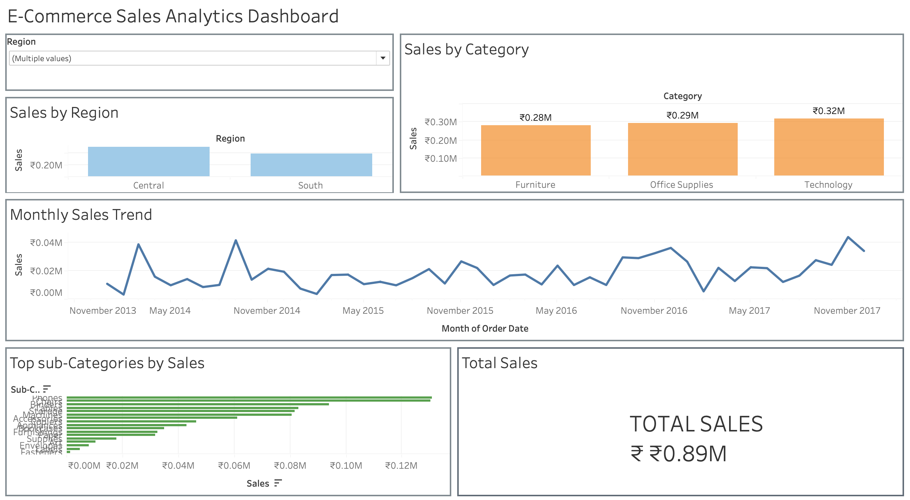

# ecommerce-sales-tableau-dashboard
Tableau dashboard analyzing e-commerce sales performance across regions, categories, and time trends.
# E-Commerce Sales Analytics Dashboard (Tableau)

This project is a Tableau dashboard built to analyze e-commerce sales performance.

The dashboard explores sales across regions, categories, and time trends using interactive visualizations.

## Dashboard Preview

## Features

- Sales by Region
- Sales by Category
- Monthly Sales Trend
- Top Sub-Categories by Sales
- Total Sales KPI
- Interactive Region Filter

## Tools Used

- Tableau Public
- E-commerce Sales Dataset (Sample Superstore)

## Files in this Repository

- Ecommerce_Sales_Dashboard.twbx – Tableau workbook
- Dashboard.png – Dashboard screenshot
- Sample - Superstore.csv – Dataset used for analysis

## Purpose

This project was created as part of my learning process in data analytics and Tableau to practice building dashboards and presenting business insights through data visualization.
